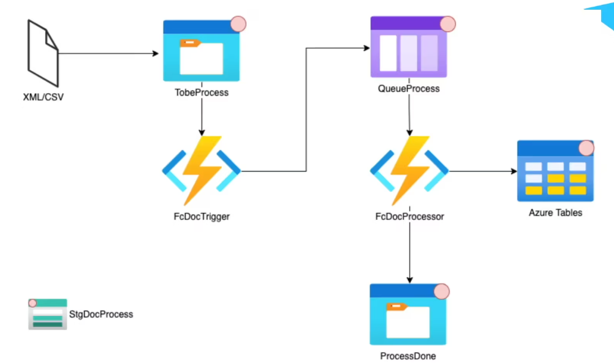

# Projeto Bufa.Functions.ProcessDocs

## Tecnologias
- Azure Functions
- C#
- Azure Storage (Blob, Queue, Table)

## Descrição
O projeto **Bufa.Functions.ProcessDocs** oferece um exemplo prático de como realizar o processamento de um arquivo XML utilizando diversas tecnologias fornecidas pela plataforma Azure. Ele demonstra o fluxo de trabalho de processamento de arquivos, desde o armazenamento até a persistência dos dados, utilizando Azure Functions, Azure Storage (Blob, Queue e Table) e a linguagem de programação C#.

### Funcionalidades
O projeto consiste nos seguintes passos de processamento:

1. **Armazenamento de Arquivo XML no Blob Storage:** A aplicação permite o envio e armazenamento de arquivos XML no Blob Storage do Azure. Neste caso, o arquivo representa uma nota fiscal.

2. **Processamento via Azure Function e Adição na Queue:** Assim que um arquivo XML é adicionado ao Blob Storage, é disparada uma função do Azure que processa o arquivo e o coloca em uma fila (Queue) para futura manipulação.

3. **Processamento de Mensagem da Queue e Adição na Table:** A função acionada pela fila (Queue) processa a mensagem recebida, extrai informações relevantes da nota fiscal e as armazena em uma Table do Azure. Além disso, o arquivo XML é transferido para um novo Blob, destinado a arquivos já processados.

## Visualização do Processo
A imagem a seguir ilustra o fluxo de processamento descrito acima:

